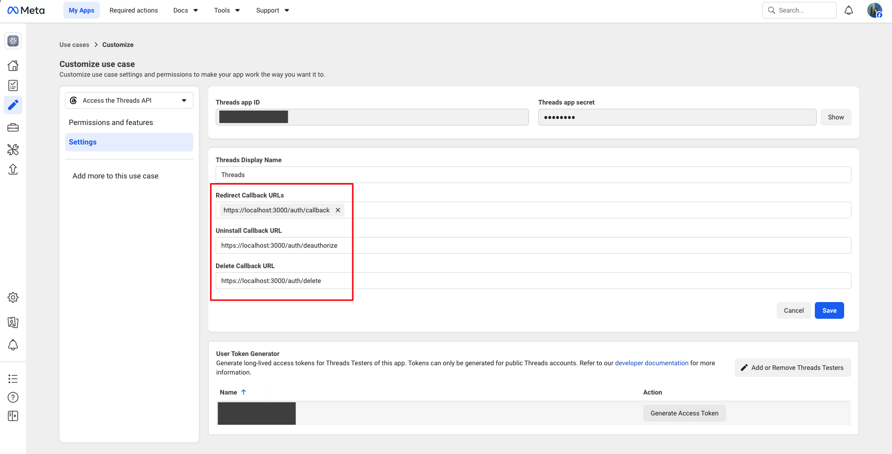

# 🧵 Threads API Access Token 取得指南

本指南將引導您從頭開始設定 Meta 開發者帳號、建立 App，並使用我們為您編寫的自動化輔助腳本，成功取得 60 天有效期的 Threads 長期 Access Token，並自動寫入專案的 `.env` 檔案中。

---

## 📋 第一階段：Meta 開發者設定與 App 初始化

Threads API 串接必須透過 Meta 開發者平台進行。請依循以下步驟完成基礎設定：

> [!TIP]
> **💡 如何開啟瀏覽器取得您的 App ID 與 Business ID？**
> 1. 請前往 [Meta for Developers 我的應用程式](https://developers.facebook.com/)。
> 2. 登入後，點擊您建立的 「 Threads 應用程式 」進入管理頁面。
> 3. 此時，您可以從瀏覽器的網址列中直接找到您的 **應用程式編號 (App ID)** `<your_app_id>`。例如網址為 `https://developers.facebook.com/apps/123456789/...`，則 `123456789` 即為您的 App ID。
> 4. 若您的應用程式有綁定 Meta 商業管理員，網址中亦會帶有 `business_id=<your_business_id>` 參數；您也可以前往 [Meta 企業商家設定](https://business.facebook.com/settings/) 取得您的 **商業管理員編號 (Business ID)** `<your_business_id>`。
> 
> **⚙️ 一鍵更新文件連結秘訣**
> 本專案提供自動化腳本，能一鍵將 `SETUP.md` 與 `GET_THREADS_TOKEN.md` 文件中所有的 `<your_app_id>` 與 `<your_business_id>` 替換為您自己實際的數值，讓文件中的超連結能直接引導您前往您專屬的設定頁面。
> 請在終端機執行：
> ```bash
> npm run customize-docs
> ```
> *(您也可以選擇使用編輯器的「搜尋與取代」功能手動進行替換，將此文件的 `<your_app_id>` 與 `<your_business_id>` 替換為您自己的實際數值)*

### 1. 建立 Meta 應用程式
1. 前往 [Meta for Developers](https://developers.facebook.com/) 並登入您的帳號。
2. 點擊右上角的 **「我的應用程式」 (My Apps)**，然後點擊 **「建立應用程式」 (Create App)**。
3. 在選擇應用程式類型時：
   - 選擇 **「其他」 (Other)**，然後點擊繼續。
   - 類型選擇 **「商業」 (Business)** 或是適用於您用途的類型。
   - 輸入您的應用程式名稱及聯絡電子郵件，完成建立。

### 2. 啟用 Threads API 使用案例 (Use Cases)
1. 前往應用程式的 [Use cases (使用案例) 列表頁面](https://developers.facebook.com/apps/<your_app_id>/use-cases/?business_id=<your_business_id>)。
2. 點擊 **「Add use case」 (新增使用案例)**（如果尚未新增）。
3. 找到 **「Access the Threads API」**，點擊 **「Set up」 (設定)**。

### 3. 取得應用程式憑證
1. 前往應用程式的 [Settings > Basic (設定 > 基本) 頁面](https://developers.facebook.com/apps/<your_app_id>/settings/basic/?business_id=<your_business_id>)。
2. 複製並記錄您的：
   - **應用程式編號 (App ID / Client ID)**
   - **應用程式密鑰 (App Secret / Client Secret)**

### 4. 設定 Threads 測試人員 (重要 ⚠️)
由於您的 Meta App 尚未正式發布（處於開發模式 Development Mode），**只有被加為「測試人員」的 Threads 帳號才能進行授權登入**。
1. 在 Meta 開發者主控板左側選單中，點擊 **「角色」 > 「角色」 (Roles > Roles)**。
2. 捲動到最下方的 **「Threads 測試人員」 (Threads Testers)** 區塊，點擊 **「新增 Threads 測試人員」 (Add Threads Testers)**。
3. 輸入您想要用來存取的 **Threads 帳號（Instagram 帳號名稱）** 並送出邀請。
4. **接受邀請（極重要）**：
   - 用手機打開您的 **Threads App**。
   - 點擊個人檔案頁面右上角的選單，依序前往 **「設定」 > 「帳號」 > 「網站權限」 (Settings > Account > Website Permissions)**。
   - 在 **「測試人員邀請」** 下，接受您剛剛發送的 Meta 應用程式邀請。

---

## ⚡ 第二階段：取得 60 天長期 Token 的兩種方案

我們為您提供了兩種取得 60 天 Token 並自動寫入 `.env` 檔案中的方案。您可以根據您的開發環境進行選擇：

### 🔹 方案 A：使用瀏覽器授權跳轉（推薦，方便日後重新取得 🔄，需設定 localhost 重新導向）

此方案使用本地輔助伺服器來處理重導向並與 Meta 交換 Token。

#### 前置準備（僅此方案需要）：設定 Threads API 重新導向 URI 與相關 URL
1. 在 Meta 開發者主控台的左側選單中，點擊 **「Use cases」 (使用案例)**，在 **「Access the Threads API」** 右側點擊 **「Customize」 (自訂)**，接著切換至頂部的 **「Settings」 (設定)** 頁籤。
   * 或者直接進入 [Threads API 設定頁面](https://developers.facebook.com/apps/<your_app_id>/use-cases/customize/settings/?use_case_enum=THREADS_API&business_id=<your_business_id>&selected_tab=settings&product_route=threads-api)。
2. 在此頁面中，請將以下三個輸入欄位填入對應的網址：
   * **Redirect Callback URLs** (重新導向回呼網址)：
     `https://localhost:3000/auth/callback`
   * **Uninstall Callback URL** (解除安裝回呼網址)：
     `https://localhost:3000/auth/deauthorize`
   * **Delete Callback URL** (刪除資料回呼網址)：
     `https://localhost:3000/auth/delete`
3. 填寫注意事項：
   > [!IMPORTANT]
   > * **選單氣泡化（關鍵）**：輸入完 **Redirect Callback URLs** 的網址後，**必須按一下 Enter 鍵或點擊下方出現的下拉建議，使其轉換為帶有 `x` 的「氣泡標籤」（如下方截圖所示）**。若只是將網址貼在欄位中而沒有將其氣泡化，Meta 將不會儲存此設定，並會在後續授權時發生 URL Blocked 錯誤（Error Code 1349168）。
   > * **這三個欄位都必須填寫**：Meta 要求同時設定這三個 URL，若有任何一個留空，可能在儲存時會被拒絕或提示錯誤。
   > * **儲存變更**：填妥並確認網址已轉換為氣泡標籤後，請務必點擊右下角的 **「Save」 (儲存)** 按鈕。

   **設定完成參考截圖：**
   

#### 執行步驟：
1. 開啟終端機，確保路徑位於 `threads-mcp` 專案根目錄下。
2. 執行以下命令來啟動輔助腳本：
   ```bash
   npm run get-token
   ```
3. 腳本會提示您輸入 **App ID** 與 **App Secret**：
   > [!TIP]
   > **macOS 快速自動帶入秘訣**  
   > 若您是 macOS 使用者，您可以先將這兩個憑證存入系統 Keychain 中：
   > ```bash
   > security add-generic-password -s "threads-app-id" -a "$USER" -w "您的_APP_ID"
   > security add-generic-password -s "threads-app-secret" -a "$USER" -w "您的_APP_SECRET"
   > ```
   > 儲存後，執行 `npm run get-token`（或 `npm run exchange-token`）時，腳本會**自動從系統 Keychain 取得憑證並帶入**，不需再手動輸入與詢問！
4. 輸入或自動帶入憑證後，腳本會輸出一個 **授權網址**：
   ```text
   https://threads.net/oauth/authorize?client_id=...&redirect_uri=https://localhost:3000/auth/callback...
   ```
5. **複製該網址並在瀏覽器中開啟**，然後登入您已接受測試人員邀請的 Threads 帳號，並同意授權。
6. 授權完成後，瀏覽器會嘗試跳轉至 `https://localhost:3000/auth/callback?code=...`：
   * 由於本地可能沒有啟用 HTTPS 伺服器，**網頁顯示「無法連線」或「連線不安全」是正常現象，請勿擔心！**
7. **直接複製瀏覽器上方網址列的「完整 URL」**（必須包含 `code=` 參數）。
8. 將複製的完整 URL 貼回終端機的輸入欄位中，然後按下 Enter。
9. 腳本會自動完成以下步驟：
   - 解析出 authorization code。
   - 向 Threads API 交換短期 Access Token。
   - 用短期 Token 換取 **60 天有效的長期 Access Token**。
   - 自動將該長期 Token 寫入專案根目錄下的 `.env` 檔案中。

   **瀏覽器授權畫面參考截圖：**
   

---

### 🔹 方案 B：使用 Graph API Explorer（免設定 localhost，初次設定最快 ⚡，對 Windows 友善）

此方案不需設定任何本機重導向 (Redirect URI) 或 Uninstall / Delete 回呼網址。只要在 Meta 提供的網頁工具中取得短期 Token，即可透過腳本快速完成長期 Token 的交換。

#### 執行步驟：
1. 前往 [Meta Graph API Explorer](https://developers.facebook.com/tools/explorer/) 並在右上角切換至您的 Threads App。
2. 點擊 **「Generate Access Token」** 取得短期 Token（效期約 1~2 小時）。
   
3. 開啟終端機，確保路徑位於 `threads-mcp` 專案根目錄下。
4. 執行以下命令來啟動交換腳本：
   ```bash
   npm run exchange-token
   ```
5. 腳本會提示您輸入：
   - **Threads App Secret (Client Secret)**
   - **在 Explorer 取得的短期 Token**
6. 腳本會自動向 Threads API 發送請求，完成交換，並將 60 天長期的 Token 自動寫入 `.env` 檔案中。

---

## 🔑 macOS 專屬功能：安全儲存至系統 Keychain

不論您是執行 **方案 A** 還是 **方案 B**，在 **macOS** 環境下，當腳本成功取得長期 Token 後皆會主動詢問：
> `偵測到 macOS 環境，是否將 Long-lived Token 存入系統 Keychain (服務名稱: threads-access-token)? (y/n):`

若您輸入 `y`，腳本會自動在背景執行以下指令將 Token 安全地寫入您的系統 Keychain：
```bash
security add-generic-password -s "threads-access-token" -a "$USER" -w "{長期 Token}" -U
```
這能確保您的 Token 在本機擁有系統層級的安全加密保護。

---

## 🔍 第三階段：驗證您的設定

完成 Token 設定後，建議透過以下兩種方式驗證您的設定是否成功：

### 1. 使用官方工具線上驗證
您可以前往 Meta 官方的 [Access Token Debugger](https://developers.facebook.com/tools/debug/accesstoken/)，將取得的 Long-lived Token 貼入進行偵錯，以確認：
* **Expires (有效期限)** 是否顯示為約 60 天（而非僅有 1~2 小時）。
* **Scopes (權限範圍)** 是否已包含 `threads_basic`, `threads_content_publish`, `threads_manage_insights`, `threads_read_replies` 等必要權限。

### 2. 執行本機專案驗證
在專案目錄下執行：
```bash
# 執行專案驗證
npx tsx src/index.ts
```
確認終端機沒有出現認證錯誤後，您的 Threads MCP 伺服器即可正常運行！

---

## 🛠️ 實用工具：驗證 Token 狀態與效期

如果您想隨時檢查手邊 Token 的剩餘時間、權限範圍或是否有效，可以使用 Meta 官方提供的偵錯工具：

* **工具名稱**：Access Token Debugger (存取權杖偵錯工具)
* **工具網址**：[Access Token Debugger](https://developers.facebook.com/tools/debug/accesstoken/)
* **主要用途**：
  1. **檢查過期時間 (Expires)**：確認您的長期 Token 是否仍有足夠的使用天數（應顯示為約 60 天），或是否已經過期。
  2. **確認權限範圍 (Scopes)**：檢查 Token 是否包含 `threads_basic`、`threads_content_publish`、`threads_manage_insights`、`threads_read_replies` 等必要權限。
  3. **偵測狀態 (Valid)**：查看 Token 是否為有效狀態（True），若 Token 已被手動撤銷或過期，此處會顯示錯誤原因。

---

## 💡 常見錯誤排查 (Troubleshooting)

* **OAuth Error / Redirect URI Mismatch**: 請確認 Meta Developers 平台中的「Valid OAuth Redirect URIs」是否精確填寫為 `https://localhost:3000/auth/callback`，且沒有多餘的斜線或空格。
* **User is not a tester**: 請確認您已在手機的 Threads App 設定中「接受」了邀請，否則 Meta 會拒絕該帳號的 OAuth 授權。
