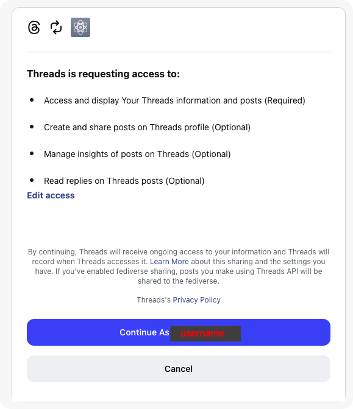
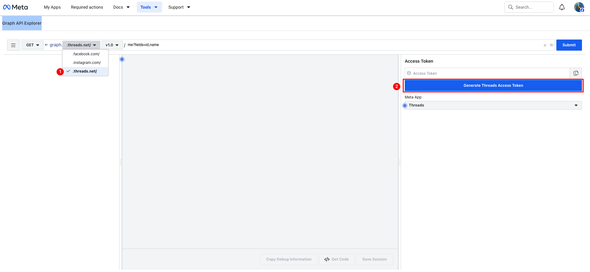
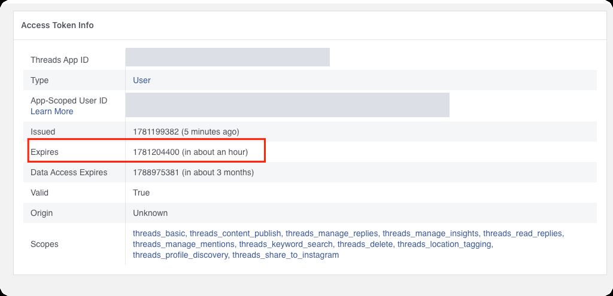

# 🧵 Threads MCP Server 設定指南 (SETUP.md)

本指南將引導您完成 Meta 開發者帳號設定、應用程式建立，並使用為您準備的自動化工具取得 **60 天有效的長期 Threads Access Token**，以利順利啟動 Threads MCP 伺服器。

---

## 🏁 前置準備 (Prerequisites)

在開始設定之前，請確認您已備妥以下資源：

1. **Instagram / Threads 個人帳號**：供後續綁定為「Threads 測試人員」並進行登入授權。
2. **Meta 開發者帳號**：請前往 [Meta for Developers](https://developers.facebook.com/) 登入並完成開發者身分註冊。
3. **Meta 商業管理員帳號 (Business Manager)**（選用）：若您在建立 Meta 應用程式時選擇「商業 (Business)」類型，必須綁定一個有效的商家管理員帳號。

---

## 📋 第一階段：Meta 開發者設定與測試帳號綁定

Threads API 必須經由 Meta 開發者平台進行認證。請依循以下步驟完成基礎設定：

> [!TIP]
> **💡 如何開啟瀏覽器取得您的 App ID 與 Business ID？**
>
> 1. 請前往 [Meta for Developers 我的應用程式](https://developers.facebook.com/)。
> 2. 登入後，點擊您建立的 「 Threads 應用程式 」進入管理頁面。
> 3. 此時，您可以從瀏覽器的網址列中直接找到您的 **應用程式編號 (App ID)** `<your_app_id>`。例如網址為 `https://developers.facebook.com/apps/123456789/...`，則 `123456789` 即為您的 App ID。
> 4. 若您的應用程式有綁定 Meta 商業管理員，網址中亦會帶有 `business_id=<your_business_id>` 參數；您也可以前往 [Meta 企業商家設定](https://business.facebook.com/settings/) 取得您的 **商業管理員編號 (Business ID)** `<your_business_id>`。
>
> **⚙️ 一鍵更新文件連結秘訣**
>
> 本專案提供自動化腳本，能一鍵將 `SETUP.md` 與 `GET_THREADS_TOKEN.md` 文件中所有的 `<your_app_id>` 與 `<your_business_id>` 替換為您自己實際的數值，讓文件中的超連結能直接引導您前往您專屬的設定頁面。
> 請在終端機執行：
>
> ```bash
> npm run customize-docs
> ```
>
> *(您也可以選擇使用編輯器的「搜尋與取代」功能手動進行替換，將此文件的 `<your_app_id>` 與 `<your_business_id>` 替換為您自己的實際數值)*

### 1. 建立 Meta 應用程式

1. 登入 [Meta for Developers](https://developers.facebook.com/)。
2. 點擊右上角的 **「我的應用程式」 (My Apps)**，然後點擊 **「建立應用程式」 (Create App)**。
3. 選擇 **「其他」 (Other)**，點擊繼續。
4. 類型選擇 **「商業」 (Business)** 或符合您用途的類型，填寫應用程式名稱後建立。

### 2. 啟用 Threads API 使用案例 (Use Cases)

1. 前往應用程式的 [Use cases (使用案例) 設定頁面](https://developers.facebook.com/apps/<your_app_id>/use-cases/?business_id=<your_business_id>)。
2. 點擊 **「Add use case」 (新增使用案例)**（如果尚未新增）。
3. 找到 **「Access the Threads API」**，點擊 **「Set up」 (設定)**。

### 3. 取得應用程式憑證

1. 前往應用程式的 [Settings > Basic (設定 > 基本) 頁面](https://developers.facebook.com/apps/<your_app_id>/settings/basic/?business_id=<your_business_id>)。
2. 複製並記錄您的：
   * **應用程式編號 (App ID / Client ID)**
   * **應用程式密鑰 (App Secret / Client Secret)**

### 4. 設定 Threads 測試人員 (重要 ⚠️)

在 App 正式發布前（開發模式中），只有被邀請的測試帳號才能進行授權：

1. 點擊左側選單的 **「角色」 > 「角色」 (Roles > Roles)**。
2. 捲動到最下方 **「Threads 測試人員」 (Threads Testers)**，點擊 **「新增 Threads 測試人員」**。
3. 輸入您要使用的 **Threads 帳號（Instagram 帳號名稱）** 並送出。
4. **手機端接受邀請（必做）**：
   * 開啟手機上的 **Threads App**。
   * 前往個人檔案頁面右上角的選單，依序選擇 **「設定」 > 「帳號」 > 「網站權限」 (Settings > Account > Website Permissions)**。
   * 點擊 **「測試人員邀請」** 並點選 **「接受」**。

---

## ⚡ 第二階段：取得 60 天長期 Token 的兩種方案

我們為您提供了兩種取得 60 天 Token 並寫入 `.env` 的方案：

### 🔹 方案 A：使用瀏覽器授權跳轉（推薦，方便日後重新取得 🔄，需設定 localhost 重新導向）

此方案透過 OAuth 瀏覽器跳轉流程取得 Token。雖然初次設定需要配置 Redirect URI，但**非常推薦作為日後重新取得/更新 Token 的常態管道**（因為只要初次設定好後，以後更新只需執行指令並點擊瀏覽器同意即可，不需每次登入 Meta 後台操作 Graph API Explorer）。

#### 前置準備（僅此方案需要）：設定 Threads API 重新導向 URI (Redirect URI)

1. 在 Meta 開發者主控台的左側選單中，點擊 **「Use cases」 (使用案例)**，在 **「Access the Threads API」** 右側點擊 **「Customize」 (自訂)**，接著切換至頂部的 **「Settings」 (設定)** 頁籤。
   * 或者直接進入 [Threads API 設定頁面](https://developers.facebook.com/apps/<your_app_id>/use-cases/customize/settings/)

## 🔐 整合與 `.env` 自動寫回

自動化腳本支援了系統安全金鑰庫（如 macOS Keychain, Windows PasswordVault, 以及 Linux Secret Service）的雙向整合，可以安全加密儲存憑證與 Token，並自動寫回至 `.env` 檔案中，免去手動管理的繁瑣步驟：

### 1. App ID 與 App Secret 的金鑰庫整合

當您執行 `npm run get-token` 或 `npm run exchange-token` 時，若您的系統安全金鑰庫或 `.env` 檔案中皆未設定憑證，腳本會主動提示您手動輸入，並進行以下自動化流程：

1. **自動偵測**：優先嘗試從系統安全金鑰庫中取得憑證，若未找到，則備用讀取 `.env` 中的環境變數（支援明文或動態解密指令），若皆無則提示手動輸入。
2. **安全儲存詢問**：若您的系統安全金鑰庫中尚未儲存憑證，腳本會主動詢問是否將其存入系統安全儲存區。
3. **自動改寫與寫回**：
   * **若您選擇 `y`**：腳本會自動將其加密存入系統安全金鑰庫，並自動將 `.env` 中的欄位修改為以下安全動態讀取指令：

     * **macOS**:

       ```bash
       THREADS_APP_ID=$(security find-generic-password -a "$USER" -s "threads-app-id" -w 2>/dev/null)
       THREADS_APP_SECRET=$(security find-generic-password -a "$USER" -s "threads-app-secret" -w 2>/dev/null)
       ```

     * **Windows**:

       ```bash
       THREADS_APP_ID=$(powershell -Command "try { ((New-Object Windows.Security.Credentials.PasswordVault).Retrieve('threads-mcp', 'threads-app-id')).Password } catch { exit 1 }")
       THREADS_APP_SECRET=$(powershell -Command "try { ((New-Object Windows.Security.Credentials.PasswordVault).Retrieve('threads-mcp', 'threads-app-secret')).Password } catch { exit 1 }")
       ```

     * **Linux**:

       ```bash
       THREADS_APP_ID=$(secret-tool lookup application threads-mcp service threads-app-id 2>/dev/null)
       THREADS_APP_SECRET=$(secret-tool lookup application threads-mcp service threads-app-secret 2>/dev/null)
       ```

   * **若您選擇 `n`（或系統不支援安全金鑰庫）**：腳本會自動將您輸入的明文儲存寫回 `.env` 檔案中，確保下次執行時不需再次輸入。

---

### 2. 長期 Token 安全存儲與 `.env` 自動替換

在取得長期 Token 後，腳本亦會主動詢問：
> `是否將 Long-lived Token 存入系統安全金鑰庫中以提高安全性？(y/n):`

* **若選擇 `y`**：腳本會將長期 Token 安全存入系統金鑰庫，並自動將 `.env` 檔案中的 `THREADS_ACCESS_TOKEN` 值替換為安全的讀取指令（格式與上述相同）：

  * **macOS**:

    ```bash
    THREADS_ACCESS_TOKEN=$(security find-generic-password -a "$USER" -s "threads-access-token" -w 2>/dev/null)
    ```

  * **Windows**:

    ```bash
    THREADS_ACCESS_TOKEN=$(powershell -Command "try { ((New-Object Windows.Security.Credentials.PasswordVault).Retrieve('threads-mcp', 'threads-access-token')).Password } catch { exit 1 }")
    ```

  * **Linux**:

    ```bash
    THREADS_ACCESS_TOKEN=$(secret-tool lookup application threads-mcp service threads-access-token 2>/dev/null)
    ```

  這能確保您的敏感憑證與 Token 不會以明文方式暴露於 `.env` 設定檔中。
* **若選擇 `n`（或系統不支援安全金鑰庫）**：腳本會將長期 Token 以明文形式直接儲存寫回 `.env`。

1. 前往應用程式的 [Settings > Basic (設定 > 基本) 頁面](https://developers.facebook.com/apps/<your_app_id>/settings/basic/?business_id=<your_business_id>)，複製並記錄您的：
   * **應用程式編號 (App ID / Client ID)**
   * **應用程式密鑰 (App Secret / Client Secret)**

#### 執行步驟

1. 在專案根目錄下，執行：

   ```bash
   npm run get-token
   ```

2. 依提示輸入 **App ID** 與 **App Secret**。
3. 腳本會嘗試自動在您的預設瀏覽器中開啟授權網址。若未自動開啟，請手動複製終端機印出的網址至瀏覽器中開啟，並同意授權。
4. 授權後，瀏覽器會跳轉至 `https://localhost:3000/...` 且顯示「無法連線」（此為正常現象，因為本機無架設 HTTPS 伺服器）。
5. **複製瀏覽器網址列的完整 URL**（包含 `code=` 參數），貼回終端機並按下 Enter。
6. 腳本會自動換取 60 天長期 Token，並更新至 `.env` 中。

   **瀏覽器授權畫面參考截圖：**
   

---

### 🔹 方案 B：使用 Graph API Explorer（免設定 localhost，初次設定最快 ⚡)

此方案**完全不需要**在 Meta 後台設定任何 localhost 重新導向網址（Redirect URIs）或處理 HTTPS 設定。適合所有開發環境（特別是希望省去繁瑣後台設定的開發者）。

#### 步驟

1. 前往 [Meta Graph API Explorer](https://developers.facebook.com/tools/explorer/) 並在右上角切換至您的 **Threads 應用程式**。
2. 點擊 **「Generate Access Token」** 取得短期 Token（效期約 1~2 小時）。
   
3. 回到專案根目錄，在終端機執行跨平台交換指令：

   ```bash
   npm run exchange-token
   ```

4. 依提示輸入 **App Secret** 與您剛剛取得的 **短期 Token**。
5. 腳本會自動呼叫 Threads API 交換 60天長期 Token，並寫入 `.env` 檔案（在支援的平台會詢問是否存入系統安全儲存區）。

---

## 🔍 第三階段：驗證 Token 設定

完成 Token 設定後，建議使用 Meta 官方工具確認 Token 正確：

前往 [Access Token Debugger](https://developers.facebook.com/tools/debug/accesstoken/)，貼入取得的長期 Token，確認：

* **Expires (有效期限)** 顯示為約 60 天（而非 1~2 小時）
* **Scopes (權限範圍)** 包含 `threads_basic`, `threads_content_publish`, `threads_manage_insights`, `threads_read_replies`

---

## 🚀 第四階段：掛載至 MCP 用戶端

完成 Token 設定後，執行自動化腳本即可將 Threads MCP 伺服器掛載至您的 Claude 用戶端：

```bash
npm run setup-mcp
```

腳本會自動：

1. 偵測 `dist/index.js` 是否存在（若不存在則自動執行 `npm run build`）
2. 讀取 Token 來源：
   * **系統安全儲存區**：優先自系統安全金鑰庫（如 macOS Keychain, Windows PasswordVault, Linux Secret Service）中取得 Token 進行動態載入，避免明文寫入設定檔。
   * **環境變數備用**：從 `.env` 讀取 Token（若 `.env` 中設定為上述之安全解密指令，則會在啟動時動態執行該指令來載入 Token）。
3. 詢問目標用戶端（Claude Desktop、Claude Code、或兩者）
4. **Claude Code**：詢問設定範圍（使用者全域 `user` 或僅限此專案 `project`），並透過 `claude mcp add` 寫入

### 手動設定參考

若不使用腳本，以下為各用戶端的手動設定方式。

#### Claude Desktop

編輯 Claude Desktop 設定檔：

* macOS: `~/Library/Application Support/Claude/claude_desktop_config.json`
* Windows: `%APPDATA%/Claude/claude_desktop_config.json`
* Linux: `~/.config/Claude/claude_desktop_config.json`

**macOS / Linux（金鑰庫動態讀取，推薦）：**

```json
{
  "mcpServers": {
    "threads": {
      "command": "sh",
      "args": [
        "-c",
        "THREADS_ACCESS_TOKEN=$(security find-generic-password -a \"$USER\" -s \"threads-access-token\" -w 2>/dev/null) node \"/path/to/threads-mcp/dist/index.js\""
      ]
    }
  }
}
```

*(如果是 Linux，請將上述 args 的指令替換為 `THREADS_ACCESS_TOKEN=$(secret-tool lookup application threads-mcp service threads-access-token 2>/dev/null) node ...`)*

**Windows（金鑰庫動態讀取，推薦）：**

```json
{
  "mcpServers": {
    "threads": {
      "command": "powershell",
      "args": [
        "-Command",
        "$env:THREADS_ACCESS_TOKEN=((New-Object Windows.Security.Credentials.PasswordVault).Retrieve('threads-mcp', 'threads-access-token')).Password; node \"C:/path/to/threads-mcp/dist/index.js\""
      ]
    }
  }
}
```

**其他備用（明文 Token）：**

```json
{
  "mcpServers": {
    "threads": {
      "command": "node",
      "args": ["/path/to/threads-mcp/dist/index.js"],
      "env": {
        "THREADS_ACCESS_TOKEN": "your_token_here"
      }
    }
  }
}
```

設定後請完全重新啟動 Claude Desktop。

#### Claude Code

`npm run setup-mcp` 選擇 Claude Code 後，會詢問範圍並自動執行 `claude mcp add`：

* **user（全域）**：所有專案皆可用，重啟 Claude Code 即生效
* **project（專案）**：僅限此專案目錄，寫入 `.mcp.json`

---

## 🖥️ 第五階段（進階）：常駐 HTTP 伺服器模式（多 IDE 共用・開機自動啟動）

預設的 **stdio 模式**下，每個 IDE／Claude 視窗都會各自啟動一份 `threads-mcp` 子行程。同時開很多視窗時，會出現多份重複行程佔用記憶體。

改用 **常駐 HTTP（Streamable HTTP）伺服器**後，整台機器只跑**一個**行程，所有 IDE 透過 `http://127.0.0.1:8307/mcp` 共用它，並支援開機自動啟動、崩潰自動重啟。

> stdio 仍是預設模式，不做以下設定就維持原本行為，兩種模式可並存。

### 1. 一鍵安裝（自動偵測作業系統）

```bash
npm run build              # 先建置出 dist/index.js
npm run install-autostart  # 安裝常駐服務（macOS / Linux / Windows 皆適用）
```

腳本會依當前平台自動採用對應機制：

| 平台 | 機制 | 安裝位置／名稱 |
| ------ | ------ | ---------------- |
| macOS | launchd user agent | `~/Library/LaunchAgents/com.threads-mcp.server.plist` |
| Linux | systemd user service | `~/.config/systemd/user/threads-mcp.service` |
| Windows | Task Scheduler 登入工作 | 工作名稱 `ThreadsMcpServer` |

自訂埠號／主機（注意 `npm run` 的參數要加 `--` 分隔）：

```bash
npm run install-autostart -- --port 8307 --host 127.0.0.1
```

移除常駐服務：

```bash
npm run uninstall-autostart
```

> **Linux 補充**：若希望未登入時也持續常駐，執行 `sudo loginctl enable-linger "$USER"`；查看日誌用 `journalctl --user -u threads-mcp -f`。

### 2. 登記給 Claude Code（切換模式）

安裝腳本結束時會印出登記指令。**切換至 HTTP 模式：**

```bash
claude mcp add --transport http --scope user threads http://127.0.0.1:8307/mcp
# 或用 Makefile 捷徑：
make use-http
```

**切回 stdio 模式（每個 IDE 各自啟動）：**

```bash
claude mcp remove --scope user threads
claude mcp add --scope user threads node -- /path/to/threads-mcp/dist/index.js
# 或用 Makefile 捷徑：
make use-stdio
```

或手動加入 `~/.claude.json` 的 `mcpServers`（HTTP 模式）：

```json
{
  "mcpServers": {
    "threads": {
      "type": "http",
      "url": "http://127.0.0.1:8307/mcp"
    }
  }
}
```

> ⚠️ 若某專案在 `~/.claude.json` 的 `projects.<path>.mcpServers` 仍保有 stdio 版的 `threads` 設定，會 shadow 掉全域 HTTP 設定 — 請一併移除。設定後重啟 Claude Code 生效。

### 3. 不想常駐？手動前景啟動

```bash
npm run start:http
# 等同於： node dist/index.js --http --port 8307 --host 127.0.0.1
```

### 4. Token 來源（常駐模式建議使用金鑰庫）

常駐服務解析 Token 的順序：先嘗試系統金鑰庫（macOS Keychain／Linux Secret Service／Windows PasswordVault），找不到再讀取專案 `.env`（以模組路徑解析，不依賴工作目錄）。

> 💡 **macOS 注意**：launchd 服務存取 `~/Documents` 底下的檔案可能受系統隱私權限（TCC）限制，導致讀不到 `.env`。建議常駐模式以金鑰庫存放 Token（執行 `npm run get-token` 時選擇「存入系統安全儲存區」），Token 會透過環境變數注入，不受工作目錄與 TCC 影響。

### 5. 設定參數對照

| CLI 旗標 | 環境變數 | 預設值 | 說明 |
| ---------- | ---------- | -------- | ------ |
| `--http` 或 `--transport http` | `MCP_TRANSPORT=http` | （未設定＝stdio） | 啟用常駐 HTTP 模式 |
| `--port <n>` | `MCP_HTTP_PORT` | `8307` | 監聽埠號 |
| `--host <h>` | `MCP_HTTP_HOST` | `127.0.0.1` | 監聽位址（僅限本機） |

> 🔒 伺服器只綁定 `127.0.0.1`，不會對外網開放，並啟用 **DNS-rebinding 防護**：會驗證請求的 `Host` / `Origin` 標頭，僅放行 loopback（`127.0.0.1` / `localhost` + 對應埠號），阻擋惡意網頁誘導使用者瀏覽器對本機服務發動請求。
>
> CLI 旗標與環境變數皆可使用；因 `VAR=value cmd` 前綴語法在 Windows 不通用，跨平台情境建議優先用 CLI 旗標。

### 6. Makefile 快捷指令（macOS）

專案提供 `Makefile`，將常用操作整合為單一指令（執行 `make` 或 `make list` 可列出所有目標）：

| 指令 | 說明 |
| ---- | ---- |
| `make install-service` | build + 安裝 launchd 服務 + 立即啟動（一次完成） |
| `make uninstall-service` | 停止並移除 launchd 服務 |
| `make service-start` | 啟動服務（同 `thmcp_load`） |
| `make service-stop` | 停止服務（同 `thmcp_unload`） |
| `make service-status` | 確認服務在 `:8307` 上運行（同 `thmcp_check`） |
| `make use-http` | Claude config 切換至 HTTP 模式 |
| `make use-stdio` | Claude config 切回 stdio 模式 |
| `make start-http` | 前景啟動 HTTP 伺服器（不安裝服務） |
| `make build` | 編譯 TypeScript → `dist/` |

---

## 🛠️ 實用工具：驗證 Token 狀態與效期

如果您想隨時檢查手邊 Token 的剩餘時間、權限範圍或是否有效，可以使用 Meta 官方提供的偵錯工具：

* **工具名稱**：Access Token Debugger (存取權杖偵錯工具)
* **工具網址**：[Access Token Debugger](https://developers.facebook.com/tools/debug/accesstoken/)
* **偵錯結果示意圖**：
  
* **主要用途**：
  1. **檢查過期時間 (Expires)**：確認您的長期 Token 是否仍有素足夠的使用天數（應顯示為約 60 天），或是否已經過期（如圖中紅框所示，短期 Token 效期通常僅約 1 小時，而長期 Token 則應為 60 天）。
  2. **確認權限範圍 (Scopes)**：檢查 Token 是否包含 `threads_basic`、`threads_content_publish`、`threads_manage_insights`、`threads_read_replies` 等必要權限。
  3. **偵測狀態 (Valid)**：查看 Token 是否為有效狀態（True），若 Token 已被手動撤銷或過期，此處會顯示錯誤原因。
